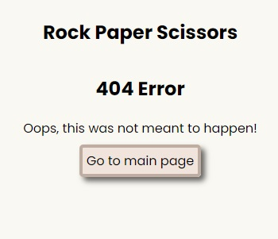

# Rock Paper Scissors
## Index
* [Live site](#live-site)
* [About](#about)
* [Site Features](#site-features)
* [Wireframe](#wireframe)
* [Testing](#testing)
* [Bugs](#bugs)
* [Deployment](#deployment)
* [Credits](#credits)
* [Validate html and CSS](#validate-html-and-css)

## Live Site
https://johnrm.github.io/rps/

([Back to top](#index))

## About
Rock Paper Scissors is an implementation of the traditional Rock Paper Scissors game.\
The player competes against the computer - The game is won with 5 winning plays.\
The computers choice is random.\
A message (Modal) Pops up when either the computer or the user gets to 5.

([Back to top](#index))

## Site features
The site features responsive pages with simple and appealing styling and an about which explains some of the background to the game.

### Navigation
The site consists of 3 pages. Navigaton between pages is via hypertext links in the form of buttons.\
Home page - 'index.html' This page includes instruction and an about section with a link to the game page - game.html\
Game page - 'game.html' - The game itself with a link back to the Home page - index.html\
404 page - '404.html' - If any page is not found, this page pops up and provides  a link back to the Home page - index.html

### Responsiveness
The site has been made responsive, development started with mobile first in mind. The site works well on mobile phone screen up to HD computer display.

### Home page
This page explains the rules to the player, and provides some background to the game in the form of a scrollable 'About' box\
The player clicks on 'Lets Play' to commence - This brings the player to the game page.\
Social media links have been provided if the player wants to follow up with the developers.

### Game page
The game page is the core of the project.\
The user is presented with a score area above 2 played cards.\
The player clicks or taps on the preferred card which is then played against the computers randomly selected card.\
When the player clicks or taps on a card, the computer generates a click and the card is played.\
The winner is shown on the played card area alongside the losing card which is shown with a Red X. The winning score is incremented by 1. A draw does not increase either score.\
The first player to 5 wins the game, the winner is declared in a Modal.\
The option th eplay again or return to Hlme page is preseted in the Modal. Clicking outside the modal does not close the modal as Game-over may be missed and game would restart.\
The Game page has also a Clickable button to return to the Home page.

### 404 page
In the event of any missing page, the user is presented with a 404 page (Page not found).\
The link on this page brings the user back to the Home page - index.html

## Wireframe
Wireframe to show a pre-development perspective of the requirement.\

## Testing 
Testing has been consistent throughout the project.\
As a feature is introduced it is tested\
Site has been give to several users for UX feedback and redevolopment as appropriate.

### Responsiveness

Expected: Website is responsive on all screen sizes and no images are pixelated or stretched. No horizontal scroll is present. No elements overlap.

Actual: All behaviour is as expected

Website was opened on the following devices and no responsiveness issues were seen:
- Google Pixel 4
- Samsung Galaxy A53
- Samsung Galaxy Tablet
- Dell Latitude 5289

### Accessibility

[Wave Accessibility](https://wave.webaim.org/) tool was used throughout development and for final testing of the deployed website to check for any aid accessibility testing.

Testing was focused to ensure the following criteria were met:

- All forms have associated labels or aria-labels so that this is read out on a screen reader to users who tab to form inputs
- Color contrasts meet a minimum ratio as specified in [WCAG 2.1 Contrast Guidelines](https://www.w3.org/WAI/WCAG21/Understanding/contrast-minimum.html)
- Heading levels are not missed or skipped to ensure the importance of content is relayed correctly to the end user
- All content is contained within landmarks to ensure ease of use for assistive technology, allowing the user to navigate by page regions
- All not textual content had alternative text or titles so descriptions are read out to screen readers
- HTML page lang attribute has been set
- Aria properties have been implemented correctly
- WCAG 2.1 Coding best practices being followed

Manual tests were also performed to ensure the website was as accessible as possible.

### Lighthouse Testing
Accessibility score was 100% for accessibility for every page in Lighthouse tools in Chrome Developertools.

index.html\

game.html\

404.html\

### Functional Testing
**Navigation Links**

Testing was performed to ensure all navigation links on the respective pages navigated to the correct pages as per design. This was done by clicking on the navigation links on each page.

| Navigation Link | Page to Load    |
| --------------- | --------------- |
| Home            | index.html      |
| Game            | game.html       |

Links on all pages navigated to the correct pages as expected.

**Game Testing**

Extensive testing was performed on the game.
Ux testng was carried out by other parties also, critique and feedback was implented in the site.

Game tests:

Play a card:\
Expected: Both computer and player card is played.\
Actual: Card is played by computer and player.

Play Audio:\
Expected: Click is generated when card is played.\
Actual: Audio plays as expected.

Card image is dispayed:\
Expected: Card image shown depends on win/lose, Red X is on losing card\
Actual: Correct card image is shown

([Back to top](#index))

## Bugs
A click sound was added towards the end of development to the game page.\
I found that this sound would play every time on page load.\
I believe this was because I was leaning on an img onclick event to trigger html audio combined with the 'button of bottons' loop.\
I removed code from game.html and added the playSound() function which is lot cleaner and works well.\

The site was throwing a manifest error to the console.\
This was corrected by updating the manifest URL link.

([Back to top](#index))

## Deployment
All Site code sits in this Github repository\
The development IDE used is Gitpod.\
Code commits are pushed to Github as the code develops with brief relevant comments.\
The live public site is published via Github Pages as follows...\
In Github, from the Dashboard, navigate to 'johnrm/rps' repository.\
Select Settings > Under Code and Automation, select Pages (Github pages)\
Under build and deployment, select the 'main' branch.\
Click Save.\
After a few minutes the site deploys is accessible here...\
https://johnrm.github.io/rps/

([Back to top](#index))

## Credits
Description of game (about) courtesy of Play and Playground Encyclopedia - https://www.pgpedia.com/

Card Graphics designed by the developer

Click sound courtesy of freesound.org - https://freesound.org/s/640020/

Social media code taken and modified from Love-Running walk-through project.

([Back to top](#index))

## Validate html, CSS and js

All HTML passes validation.\
CSS passes validation.\
Javascript passes validation in JSHint with no errors and one warning...\
Functions declared within loops referencing an outer scoped variable may lead to confusing semantics. (computerRPS, computerGuess, userRPS, playSound, pickWinner, showCards, updateScore, userScore, computerScore, gameOver)\

([Back to top](#index))